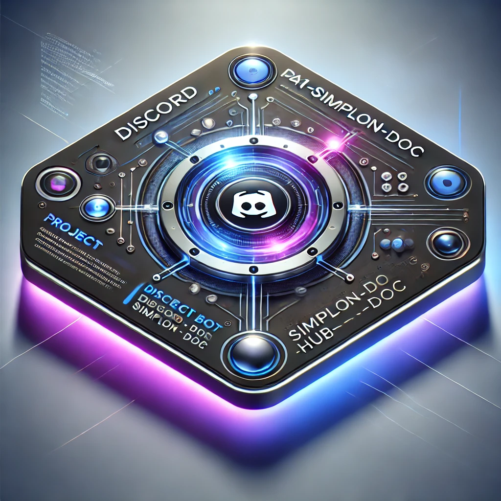

# Discord Bot - Hub Simplon

  

  

# 📚 Bot Discord pour Simplon : Introduction

  

## 📖 Sommaire

1. [Contexte du projet](#1-contexte-du-projet)

2. [Vision Globale](#2-vision-globale)

3. [Objectifs Principaux](#3-objectifs-principaux)

- [Encourager le partage de ressources](#encourager-le-partage-de-ressources)

- [Système de progression basé sur la reconnaissance](#système-de-progression-basé-sur-la-reconnaissance)

- [Modération semi-automatique du contenu](#modération-semi-automatique-du-contenu)

- [Gestion des doublons](#gestion-des-doublons)

4. [Pourquoi ce projet est-il important ?](#4-pourquoi-ce-projet-est-il-important)

- [Engagement de la communauté](#engagement-de-la-communauté)

- [Reconnaissance des membres](#reconnaissance-des-membres)

- [Environnement sûr et modéré](#environnement-sûr-et-modéré)

5. [Conclusion](#5-conclusion)

  

---

  

## 1. Contexte du projet 🎯

  

Simplon, un établissement de formation spécialisé dans le développement des compétences numériques, accueille une communauté dynamique composée d'étudiants, de formateurs et d'autres professionnels du numérique. Dans ce contexte, le projet vise à créer un **bot Discord** pour **automatiser et animer les échanges** au sein de cette communauté, tout en assurant une **modération efficace** afin de maintenir un environnement respectueux et constructif.

  

Le bot jouera un rôle clé dans la gestion de la communauté, notamment en **récompensant les membres pour leurs contributions** et en **modérant automatiquement les contenus inappropriés**. 🛡️

  

---

  

## 2. Vision Globale 🌍

  

L'objectif principal de ce bot est de **renforcer l'engagement** des membres en mettant en place un système de **reconnaissance** pour les utilisateurs actifs. Il encourage le **partage de ressources** et valorise les membres qui apportent une valeur ajoutée à la communauté. 🚀 En parallèle, il garantit que le contenu partagé reste **pertinent et approprié** grâce à un système de modération semi-automatique.

  

Le bot prendra également en charge la **gestion des doublons**, la **suppression automatique des contenus inappropriés**, et l'attribution de sanctions en cas de violation des règles. ⚠️

  

---

  

## 3. Objectifs Principaux 🎯

  

### Encourager le partage de ressources 🌐

  

- Offrir un espace où les membres peuvent partager des liens, articles ou documents utiles dans un canal dédié.

- Les contributions sont évaluées par la communauté à travers des réactions "like" 👍 ou "dislike" 👎, influençant ainsi la réputation et le niveau des utilisateurs.

  

### Système de progression basé sur la reconnaissance 📈

  

- Chaque utilisateur cumule des points en fonction des "likes" reçus sur ses contributions.

- En fonction du nombre de points, l'utilisateur accède à des **avantages spécifiques** comme des rôles spéciaux ou des avantages exclusifs. 🏅

  

### Modération semi-automatique du contenu 🚫

  

- Le bot surveille en permanence les canaux pour détecter et supprimer les contenus inappropriés (comme les liens vers des sites pornographiques ou du contenu NSFW).

- Les utilisateurs peuvent signaler des messages grâce à une commande dédiée (`!report`), ce qui alerte directement les modérateurs et entraîne la suppression automatique du contenu si nécessaire.

  

### Gestion des doublons 🔍

  

- Si un lien ou une ressource déjà partagée est reposté, le bot compare les deux publications et garde celle qui a la description la plus complète.

- Si le doublon est jugé meilleur que le post de base, le post de base est supprimé et le doublon prend sa place.

- Les points du post supprimé sont transférés à la publication conservée. 🎯

  

---

  

## 4. Pourquoi ce projet est-il important ? ❓

  

### Engagement de la communauté 💬

  

Simplon valorise l'apprentissage collaboratif et le partage de connaissances. En récompensant les utilisateurs pour les ressources qu'ils partagent, ce projet permet de **stimuler la participation active** et d'encourager la diffusion de **contenus de qualité**. 📚

  

### Reconnaissance des membres 💪

  

Le système de "likes" 👍 et "dislikes" 👎 permet aux utilisateurs de recevoir un retour immédiat sur leurs contributions, ce qui renforce leur **estime de soi** (inspiré de la pyramide de Maslow). Ce mécanisme incite les utilisateurs à s'améliorer et à **contribuer davantage** à la communauté. 🙌

  

### Environnement sûr et modéré 🛡️

  

Il est essentiel de garantir que la communauté reste un espace **respectueux et productif**. Grâce à la **modération automatique** et aux signalements communautaires, le bot s'assure que les interactions restent **appropriées**, et que les contenus inappropriés sont rapidement supprimés. ✅

  

---

  

## 5. Conclusion 🏁

  

Ce projet vise à **stimuler l'animation** de la communauté Simplon, en récompensant les contributions pertinentes et en garantissant un environnement sûr et modéré. Le bot représente un **outil essentiel** pour maintenir une dynamique de collaboration et encourager le **partage de connaissances**. 📈 Grâce à une **modération automatisée** et un système de **reconnaissance motivant**, ce bot permettra à la communauté de croître et de rester un espace d'échanges constructifs et respectueux. 🌟

  

---
---
  

---

